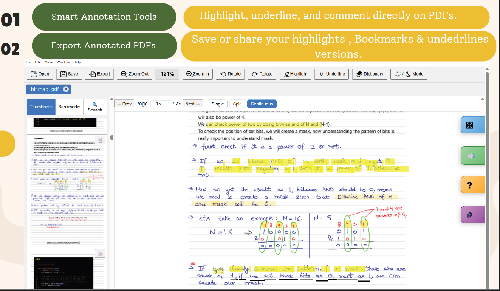
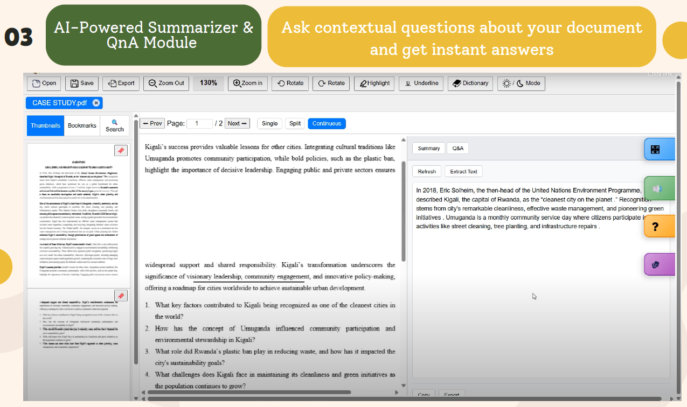
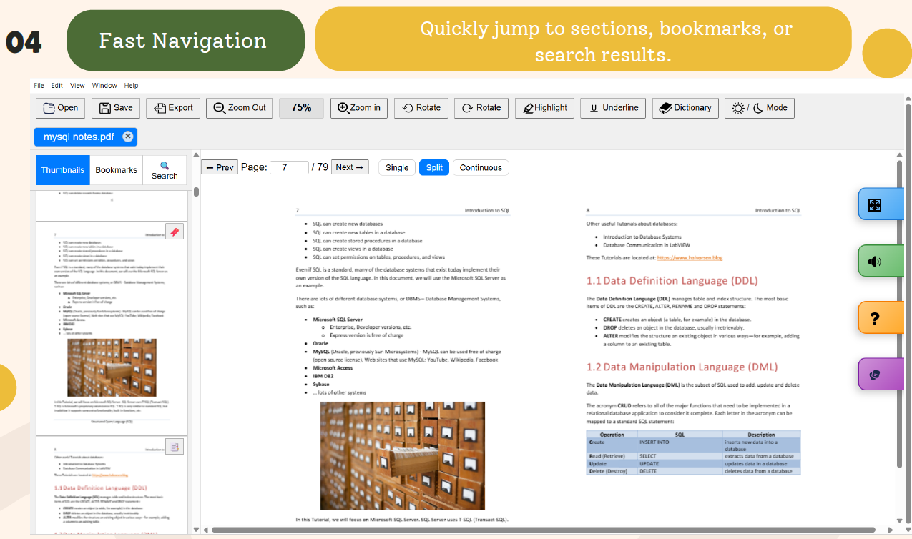
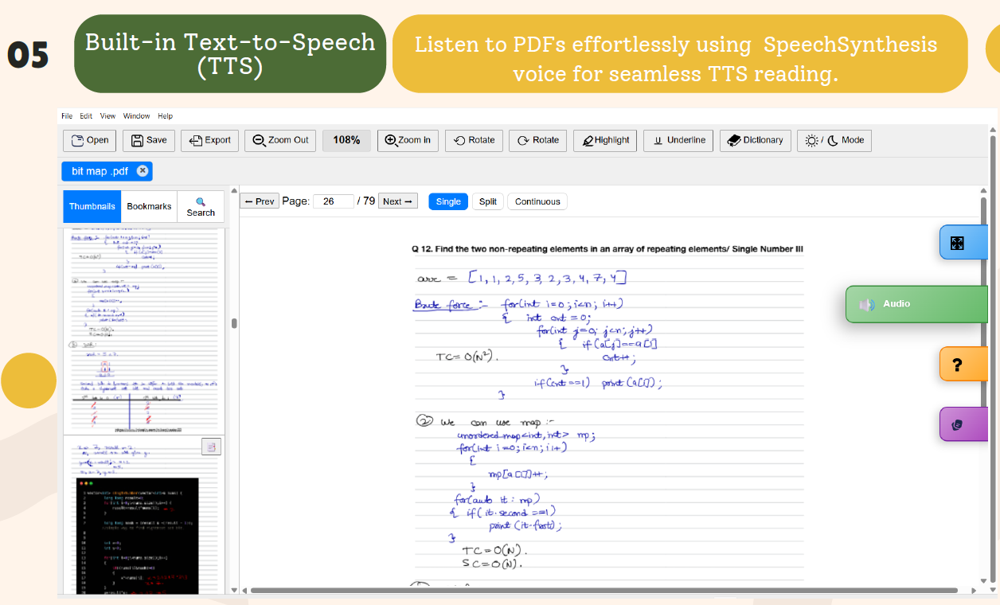
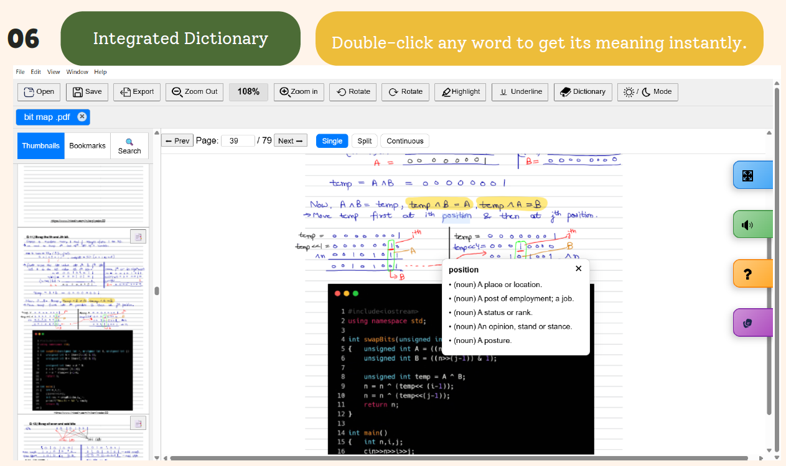

#  Scriptoria: Advanced Desktop PDF Reader with AI-Powered Annotations


>  Scriptoria is a **next-generation Desktop PDF Reader with Annotations** built using **Electron** and **pdf.js**, designed for researchers, students, and avid readers who want to go beyond just reading — and start interacting with their documents.

---

##  Overview

**Scriptoria** is not just a PDF reader — it's an **intelligent reading companion**.  
With powerful annotation tools, seamless **text-to-speech (TTS)**, and **AI-powered question answering**, Scriptoria transforms reading into an interactive experience.

---

##  Features

### Basic Features
-   **Multi-tab Interface** – Open and read multiple PDFs simultaneously.
-   **Seamless Navigation**: Quickly jump between pages using next/previous buttons or direct page input.
-   **Page Preview Modes**: Switch between Single, Split, and Continuous viewing for personalized reading
-   **Dynamic View Adjustment**: Rotate pages left or right for flexible reading orientations.
-   **Precision Zooming**: Smooth Zoom In/Out functionality for detailed content inspection.
-   **Annotations** – Highlight, underline, and bookmark key sections.
-   **Save & Export** – Save your annotations locally for future reference.
-   **Reader Modes** – Light/Dark mode and full-screen view for comfortable reading.

###  Advanced Features
-  **AI Summarization** – Generate concise summaries of your PDF documents.
-  **Interactive Q&A** – Ask natural language questions about the document content.  
-  **Text-to-Speech (TTS)** – Listen to the PDF text read aloud using modern speech synthesis.  
-  **Dictionary & Translation** – Instantly look up meanings and translate selected text to Hindi.
-  **OCR Support** – Extract text from image-based PDFs using Tesseract.js.

---

##  Tech Stack

| Layer | Technology |
|:------|:------------|
| **Desktop Framework** | Electron |
| **PDF Engine** | pdf.js , Tesseract.js (OCR ) |
| **Frontend** | HTML, CSS, JavaScript |
| **AI Backend** | Python Flask (Gemini API / Hugging Face API) |
| **OCR** | Tesseract.js |
| **Utilities** | Node.js, File System APIs |
| **Annotations** | JSON sidecars per-PDF , SHA-256 hashing |
| **AI/ML** | Python, Jupyter Notebook, Hugging Face Transformers library , PyTorch , Flask |
| **Models** | Helsinki-NLP opus-mt, DistilBERT-cnn-12-6 |
| **Database** | local Storage |
| **TTS** | SpeechSynthesis |
| **Dictionary** | Free dictionary API |

---

##  Screenshots

###  Annotations


### Summarizer and QnA


###  Navigation


###  Text-to-speech


###  Dictionary


---
## Installation and Setup

### Prerequisites
- [Node.js](https://nodejs.org/) (v18 or later)
- [Python 3.10+](https://www.python.org/downloads/)

### 1. Clone the Repository
```bash
git clone https://github.com/SoftaBlitz-2k25/Scriptoria.git  
cd Scriptoria
```  

### 2. Install Node.js Dependencies  
```bash
npm install
```    

### 3. Install Python Dependencies
```bash
pip install flask flask-cors python-dotenv google-generativeai requests
```

### 4. Configure API Keys

Create or edit the file `model/.env` and add **one** of the following API keys:

```env
# Option 1: Google Gemini API (Recommended — free, fast, high quality)
GEMINI_API_KEY=your_gemini_api_key_here

# Option 2: Hugging Face Serverless Inference API
HF_TOKEN=your_hugging_face_token_here
```

**How to get API keys:**
- **Gemini**: Go to [Google AI Studio](https://aistudio.google.com/apikey) → Create API Key
- **Hugging Face**: Go to [HF Settings > Tokens](https://huggingface.co/settings/tokens) → New token (Read access)

> **Note:** If no API key is configured, the server will fall back to running models locally on your CPU. This requires ~5GB of RAM and PyTorch installed (`pip install torch transformers`).

### 5. Start the AI Server
Open a terminal and run:
```bash
cd model
python server.py
```
You should see:
```
[INFO] Gemini API initialized successfully (using gemini-1.5-flash).
[INFO] Bypassing local model loading — cloud API is active.
 * Running on http://127.0.0.1:5001
```

### 6. Launch the App
Open a **second terminal** and run:
```bash
npm start
```

---

## Usage Guide  

1. **Open PDF files** from your local system using the toolbar or drag-and-drop.  
2. **Annotate** using the toolbar options (highlight, underline, bookmark).  
3. **Summarize** by clicking the purple Summarizer tab on the right side.
4. **Ask Questions** using the Q&A tab to get answers based on your document content.
5. **Translate** selected text to Hindi using the Translate toolbar button.
6. **Text-to-Speech** — Click the Audio tab to listen to the current page or selected text.
7. **Dictionary** — Select a word and click Dictionary to look up its meaning.
8. **Export** your annotated PDF using the Export button.

---

## Project Structure

```
Scriptoria/
├── main.js              # Electron main process
├── preload.js           # IPC bridge between main and renderer
├── renderer.js          # Core PDF viewer logic
├── index.html           # Main UI layout
├── styles.css           # Application styles
├── model/
│   ├── server.py        # Flask AI backend (Gemini/HF API/Local)
│   └── .env             # API key configuration
├── advance/
│   ├── summarize.js     # PDF summarization + Q&A panel
│   ├── translate.js     # English → Hindi translation popup
│   ├── dictionary.js    # Dictionary lookup popup
│   └── exportToPdf.js   # Export PDF with annotations
├── features/
│   ├── text-store.js    # Centralized text storage per page
│   ├── tts.js           # Text-to-speech engine
│   ├── bookmarks.js     # User bookmark management
│   ├── highlights.js    # Highlight annotation storage
│   ├── underlines.js    # Underline annotation storage
│   └── stickynotes.js   # Sticky notes storage
├── build/
│   └── ocr.js           # Tesseract.js OCR integration
└── icons/               # SVG toolbar icons
```
